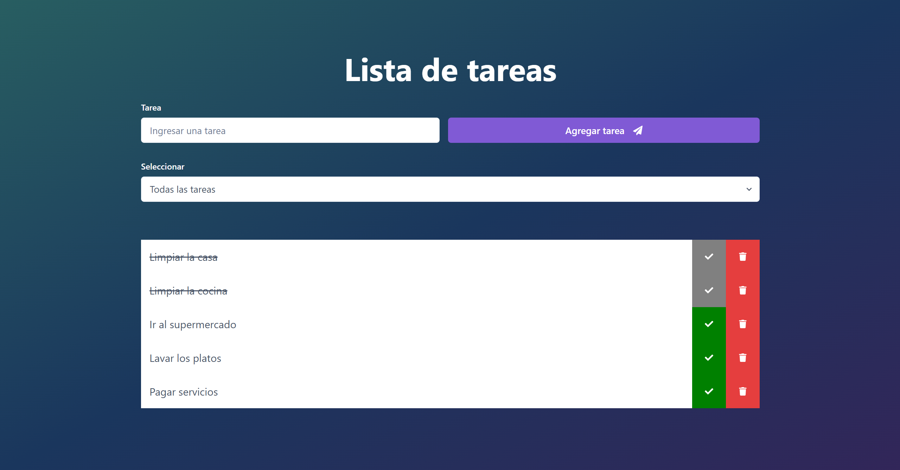

<h1>To Do List | React TP1</h1>
    

      El presente proyecto fue realizado como trabajo práctico de ADA. tiene como propósito servir de anotador de tareas
      pendientes.
    

    <h3>Tecnologías</h3>
    <ul>
      <li>React</li>
      <li>Chakra UI</li>
      <li>Vite</li>
    </ul>
    
    <h3>Funcionalidades</h3>
    <ul>
      <li>Ingresar una nueva tarea a través de un input text</li>
      <li>Agregar la tarea ingresada a una lista través de un botón</li>
      <li>Avisa cada vez que se quiera ingresar una nueva tarea sin haber completado el campo de texto</li>
      <li>Filtrar la lista según su estado (todas, completadas, incompletas)</li>
      <li>Tachar las tareas completadas a través de un botón</li>
      <li>Eliminar tareas a través de un botón</li>
    </ul>
        <h3>Para utilizar el proyecto</h3>
    <ol>
      <li>Cloná el repositorio desde tu terminal de git</li>
      <li>Instalá las dependencias del proyecto a través de npm install</li>
      <li>Ejecutá el proyecto mediante npm run dev</li>
    </ol>

<h4>Trabajo deployado en Netlifly</h4>
    

      ¡Testeá el proyecto! Aquí el link
    

        

      https://todolistnere.netlify.app/
    

